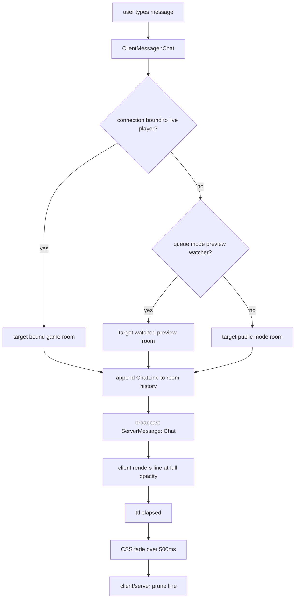

# Room Chat

Chat is room-scoped rather than globally broadcast. The same transport is used for lobby-mode chat,
queue-mode preview chat, live match chat, and spectator chat, but the server resolves a different
target room depending on what the connection is currently attached to.

## Room Types

There are two logical room families:

- **mode room**: the public instance for one mode such as `ffa`, `arena`, or the public `bullet` preview board
- **game room**: a private queue-match instance such as `bullet__<uuid>`

Non-queue modes only expose the mode room. Queue modes expose both:

- while choosing a kit, waiting in queue, or watching the preview board, the client is in the mode room,
- once the player joins a spawned private match, the client switches to the game room,
- if that match ends and the client returns to preview/overlay flow, chat switches back to the mode room.

## Server Routing

`server/src/handlers/ws/session.rs` resolves the destination room for each `ClientMessage::Chat`:

1. if the connection is actively bound to a player, send to that bound `GameInstance`,
2. otherwise, for queue modes, try the currently watched preview instance,
3. otherwise, for queue modes, fall back to the public joinable mode instance,
4. otherwise, for non-queue modes, use the public lobby/mode instance.

That means the server never needs a separate chat-room registry. Room identity is derived from the
same `GameInstance` that already owns the authoritative board state.

## Sender Identity And Color

The chat identity logic also depends on connection state:

- active players use their live in-game `player.name` and `player.color`,
- queued or unbound users use a grey sender color,
- if the client supplies a blank or noisy fallback name, the server sanitizes it before use.

The sender color is stored in each `ChatLine` so spectators and reconnecting clients see the same
identity that existed when the message was sent.

System-generated hook messages are sent as `is_system = true` chat lines with yellow styling on
the client.

## Retention, Fade, And Pruning

Each room stores chat in a bounded history owned by the game instance.

- `chat_message_ttl_ms` controls how long a line stays fully visible,
- the client then fades the line out over `500ms` using CSS opacity transitions,
- the server and client both prune only after `ttl + 500ms`,
- the history is capped to 120 lines per room even if messages are newer than the TTL.

This split is intentional: the server guarantees stale history disappears for reconnecting clients,
while the client owns the visual fade so the animation stays smooth.

## Client Rendering Rules

The chat overlay is rendered by the dedicated `client/src/components/game_view/chat.rs` component.

It handles:

- adaptive contrast:
  - in-game on the light board, message text uses darker greys and darker shadows
  - out-game on dark overlays, message text uses lighter greys and lighter shadows
- client-side URL linkification for `http://`, `https://`, and `www.` prefixes
- a live `current/max` counter once the draft length crosses `chat_warning_chars`
- focus retention on send, and blur only when the user clicks outside the input

Linkification is client-only. The server stores and rebroadcasts the original plain text message.

## Chat Flow Diagram

