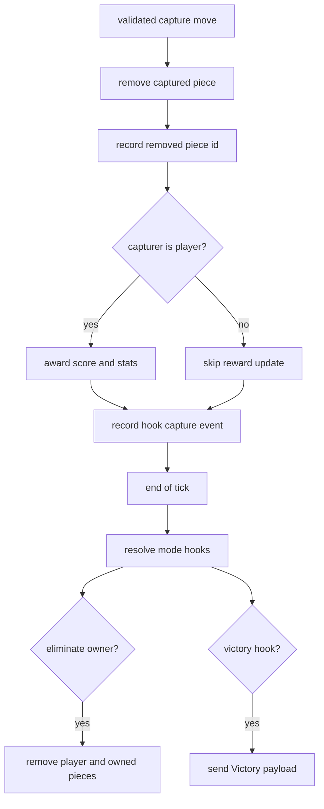

# Combat, Captures, And Hooks

Combat in `ffchess` is simple at the board layer and rich at the mode layer:

- the board layer removes pieces and awards score,
- the mode layer decides whether a capture also eliminates a player or ends the match.

## Capture Application

The core server helpers live in `server/src/instance/captures.rs`.

On a successful capture:

1. The target piece is removed from `game.pieces`.
2. Its id is pushed into `removed_pieces` for the next `UpdateState`.
3. If the capturer is a player:
   - `score` increases by the captured piece config's `score_value`,
   - `pieces_captured` increments,
   - `kills` increments when the captured piece id is treated as a king.
4. A hook event is recorded for end-of-tick resolution.

## King Semantics

There is no separate boolean "is king" flag in the piece config.

The runtime treats a piece as a king when its piece id:

- is exactly `king`, or
- ends with `_king`

That rule affects:

- kit validation,
- kill counting,
- common hook targeting patterns.

## Hook Buffering

Hook resolution is deliberately delayed until the end of the tick.

The server records events into `HookEventBuffer`:

- capture events,
- "a player left" events.

At the start of a tick, queued events are promoted into the active buffer.
At the end of the tick, the active buffer is resolved against the mode's configured hooks.

This keeps capture side effects deterministic even when several things happen inside one tick.

## Supported Hook Outcomes

### `OnCapture` + `EliminateOwner`

If the captured piece matches `target_piece_id`, remove that captured piece's owner from the game.
All of their remaining pieces are removed and their queued premoves are cleared.

### `OnCapturePieceActive` + `WinCapturer`

If the capture matches, send the capturing player a victory payload.

`victory_focus` decides whether the client:

- stays on the current camera target, or
- centers on the capture square.

### `OnPlayerLeave` + `WinRemaining`

If a player left during the tick and the remaining player count matches `players_left`
(or `players_left` is omitted), send victory to the remaining player.

## Victory Delivery

The server sends `ServerMessage::Victory` with:

- `title`
- `message`
- `focus_target`

The client switches into its victory/dead phase and the camera may keep its current view or focus
the capture square depending on the payload.

## Combat Diagram

