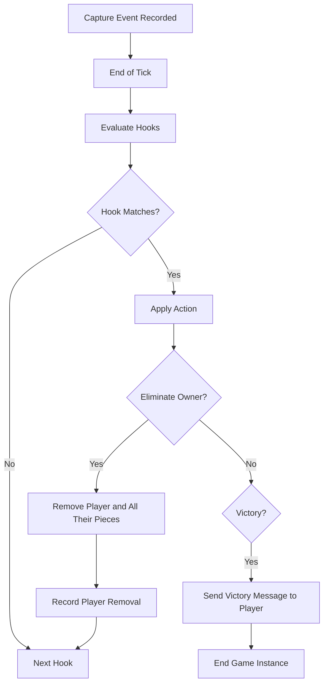

# Combat, Captures, and Hooks

Combat in the game occurs when a piece moves onto a square occupied by an opponent's piece. This event triggers a series of actions including reward distribution and hook evaluation.

## Captures

When a piece is captured:

1.  **Removal**: The captured piece is removed from the `pieces` map in the `GameState`.
2.  **Notification**: The piece's ID is recorded in `removed_pieces` and sent to clients in the next `UpdateState` message.
3.  **Reward Distribution**: If the capturer is a player, they receive:
    *   **Score**: Based on the `score_value` from the captured piece's configuration.
    *   **Stats**: Increment of `pieces_captured` and potentially `kills` (if the captured piece was a king).
4.  **Hook Recording**: The capture event is recorded in a buffer for later processing by the hook system.

## Hooks

Hooks allow for custom logic based on gameplay events, such as king capture leading to player elimination.

### Hook Triggering

Hooks are processed at the end of each server tick in `resolve_tick_hooks`. The system evaluates the recorded events against the `hooks` configuration for the current game mode.

### Supported Hooks

-   **EliminateOwnerOnCapture**: If a piece of a specific type (e.g., `king`) is captured, its owner is eliminated from the game. All of the eliminated player's remaining pieces are removed.
-   **WinCapturerOnActiveCapture**: If a player captures a target piece type, they are immediately declared the winner.
-   **WinRemainingOnPlayerLeave**: If only a certain number of players remain (usually 1), the remaining player(s) are declared winners.

### Hook Resolution Flow

## Reward and Score

Scores and kills are important for the leaderboard:
- `score` is updated for any capture.
- `kills` is specifically incremented when a piece marked as a `king` is captured.
- This information is broadcast to all clients to keep the leaderboard in sync.
