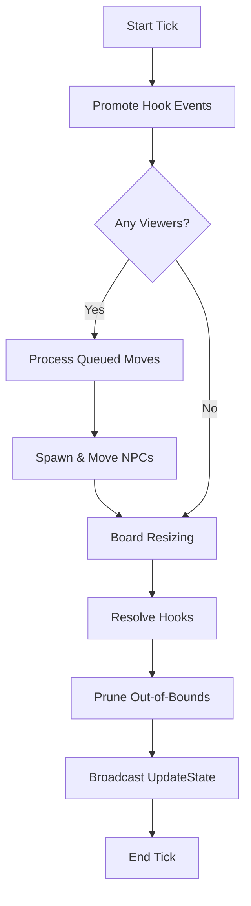

# Game Loop and Ticking

The server operates on a periodic tick system to maintain game state, process automated behaviors, and broadcast updates to clients.

## The Tick Cycle

The main game loop is driven by the `handle_tick` method in `GameInstance`. This method is executed at a regular interval (typically every 50ms).

### Tick Sequence

1.  **Start Tick Hooks**: Any events from the previous tick that are queued for hook processing are promoted to the active buffer.
2.  **View Status Check**: The server checks if any players or spectators are currently viewing the instance. If not, certain expensive operations (like NPC logic) are paused.
3.  **Process Queued Moves**: Executes any player moves that were queued due to cooldowns.
4.  **NPC Logic**:
    *   **Spawning**: Checks NPC limits and spawns new pieces if needed.
    *   **Ticking**: Moves NPCs according to their AI rules.
5.  **Periodic Cleanup**: Every 600 ticks (~30 seconds), the server performs maintenance:
    *   Cleans up old death timestamps.
    *   Removes expired session secrets.
    *   Purges inactive colors from the color manager.
6.  **Board Resizing**: Calculates the target board size based on the current player count. If the board should shrink and no player pieces are outside the new bounds, the board is resized.
7.  **Pruning**: Any pieces or shops that are now out of bounds are removed.
8.  **Resolve Tick Hooks**: Evaluates gameplay hooks (like king capture) and applies their effects (elimination, victory).
9.  **Broadcast**: Collects the full game state and broadcasts an `UpdateState` message to all connected clients.

## Mermaid Diagram: Tick Flow

## State Synchronization

The `UpdateState` message contains:
- List of all active players and their scores.
- List of all active pieces and their positions.
- List of all active shops.
- IDs of pieces and players removed in this tick.
- Current board size.

Clients use this message to update their local state and interpolate piece movements.
