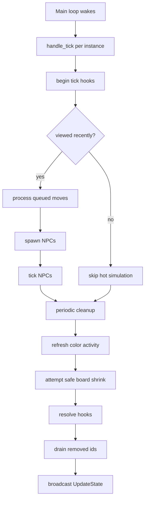

# Game Loop

The authoritative server loop lives in `server/src/main.rs`. It wakes every `100ms` and runs two
top-level tasks:

1. `tick_all_games()`
2. `tick_previews()`

Each `GameInstance` then runs its own `handle_tick()` routine.

## Per-Instance Tick Order

`server/src/instance/ticks.rs` currently performs work in this order:

1. Promote queued hook events into the active tick buffer.
2. Check whether any player channels or spectator channels are attached.
3. Refresh `last_viewed_at` when someone is watching.
4. If the instance has been viewed within the last 5 seconds:
   - process server-side queued moves,
   - spawn NPCs up to the configured limits,
   - advance NPCs that are off cooldown.
5. Every 600 ticks (roughly 60 seconds with a 100ms server loop):
   - prune death timestamps older than 10 minutes,
   - prune session secrets older than 5 minutes,
   - prune stale color claims older than 24 hours.
6. Refresh color activity for currently connected players.
7. Recalculate the target board size and shrink only if no player-owned piece would fall outside the new boundary.
8. Resolve buffered hooks for the completed tick.
9. Drain `removed_pieces` and `removed_players`.
10. Broadcast a full `UpdateState` snapshot to active players and passive viewers.

## Why NPCs Pause When Unwatched

The server intentionally gates queued moves and NPC simulation behind a recent-view check:

- if nobody has looked at the instance for more than 5 seconds, the board effectively idles,
- state still exists,
- players can reconnect and resume,
- but background NPC churn is avoided for dormant instances.

## Board Resizing In The Tick

Shrinking is conservative:

- the target size is computed from the mode's `board_size` expression,
- the board only shrinks if every player-owned piece is already inside the target boundary,
- once the shrink happens, NPCs and shops outside the new bounds are pruned immediately.

Growing is handled when new players join, not here.

## Broadcast Payload

At the end of the tick, the server sends one `ServerMessage::UpdateState` containing:

- all current players,
- all current pieces,
- all current shops,
- all piece ids removed during the tick,
- all player ids removed during the tick,
- the current board size.

The client treats this as authoritative state and layers prediction on top of it.

## Tick Diagram

