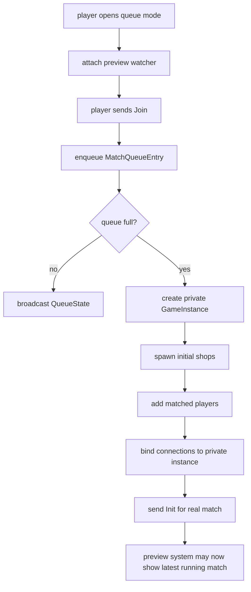

# Matchmaking, Preview Boards, And Private Matches

Queue-based modes such as `duel` and `bullet` do not send players directly into the public mode
instance. Instead, the server layers matchmaking and preview logic on top of the same `GameInstance`
type.

## When A Mode Becomes A Queue Mode

`GameModeConfig.queue_players` controls this behavior.

- `0` or `1`: normal public mode, no matchmaking queue
- `>= 2`: queue mode

The queue size is the exact number of players required to launch a match.

## Public Instance vs Private Match Instance

Queue modes use two kinds of game instances:

- **public instance**: the default mode instance created at server startup
- **private instance**: a hidden instance created when the queue fills

The public instance is used as the spectator/preview board.
The private instance is where the actual queued match runs.

Private mode ids are generated like:

```text
<public_mode_id>__<uuid>
```

The private instance copies the original mode config but resets `queue_players` to zero so the
running match behaves like a normal active game.

## Queue Entries

Each queued player is stored as a `MatchQueueEntry` containing:

- connection id
- outbound websocket sender
- player name
- selected kit name

When a new entry is added:

1. any previous queue entry for the same connection is replaced,
2. the entry is appended,
3. if the queue is still short, the player stays waiting,
4. once the queue length reaches the required size, the oldest `N` entries are drained into a new private match.

## Preview Watchers

While queued or while choosing a kit in a queue mode, a connection can watch a preview board.

The preview system tracks:

- watcher channels,
- whether a watcher wants the default public board only,
- the current preview target mode id,
- how long the current preview target has been empty.

### Preview Target Rules

The server prefers:

1. the latest running private match for that public mode,
2. otherwise the default public instance.

If a private preview target becomes empty, the server waits `preview_switch_delay_ms` before
switching away from it. That keeps the preview stable across abrupt match endings.

## Queue Layout

If a queue mode defines `queue_layout`, private matches spawn players from exact preset slots instead
of the random kit-cluster spawn used by sandbox modes.

Each slot can also set `board_rotation_deg`, which is how bullet mode gives both players opposite
perspectives on the same board.

## Queue Countdown

If `queue_countdown_ms > 0` on the mode config:

- the private match still spawns all players and pieces immediately,
- the server sets `move_unlock_at` on the instance,
- the client removes the join overlay and renders the live board,
- premoves are allowed during the countdown,
- authoritative movement execution waits until `now >= move_unlock_at`.

This is why bullet mode can show the full starting board for a few seconds before the first move is
legal without delaying room creation or chat-room switching.

## Connection Binding Flow

The server tracks three layers of association:

- passive preview/lobby connection channel,
- active player channel,
- connection-to-player binding in `ServerState`.

### Join Flow

For a queue mode:

1. keep the connection registered as a preview watcher,
2. enqueue the player,
3. when matched, remove preview watcher status,
4. create or reuse the private match instance,
5. add each player to the private instance,
6. bind each connection id to its `(player_id, instance)`.

### Leave Or Disconnect

- leaving a private match removes the bound player from that instance,
- leaving a queue removes the queue entry and rebroadcasts queue positions,
- disconnecting from preview mode removes the preview watcher,
- empty private matches are cleaned up from the hidden instance registry.

## Matchmaking Diagram


