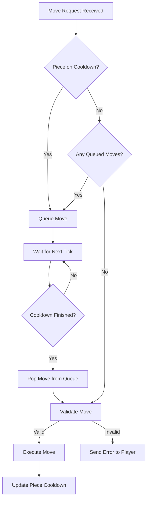

# Movement and Move Validation

Movement is the core mechanic of the game. It involves player input, validation against piece-specific rules, and handling of cooldowns and premoves.

## Move Validation

The validation logic resides in `common/src/logic.rs` within the `is_valid_move` function. It performs several checks to ensure a move is legal:

1.  **Bound Check**: The target coordinate must be within the current board bounds.
2.  **Square Content**:
    *   **Quiet Move**: The target square must be empty.
    *   **Capture**: The target square must contain an opponent's piece.
3.  **Path Validation**:
    *   The piece's configuration (`move_paths` or `capture_paths`) is consulted.
    *   The relative displacement must match one of the predefined steps in the configuration.
    *   If a path has multiple steps (sliding), all intermediate tiles must be empty.

## Cooldowns and Queuing

To prevent spamming and allow for tactical planning, moves are subject to cooldowns.

### The Cooldown System

-   Each piece has a `cooldown_ms` defined in its configuration.
-   When a piece moves, its `last_move_time` is updated to the current server timestamp.
-   A piece can only move again if `now - last_move_time >= cooldown_ms`.

### Queued Moves (Premoves)

If a player attempts to move a piece that is still on cooldown, the server may queue the move:

1.  If the piece is currently cooling down, the move request is added to a `queued_moves` buffer for that piece.
2.  The buffer can hold up to 100 queued moves per piece.
3.  During each server tick, the `process_queued_moves` function checks if the cooldown has expired for pieces with queued moves.
4.  If the cooldown has elapsed, the next move in the queue is validated and executed.
5.  If a move in the queue becomes invalid (e.g., the target square is no longer empty), it is discarded and an error is sent to the player.

## Mermaid Diagram: Move Execution

