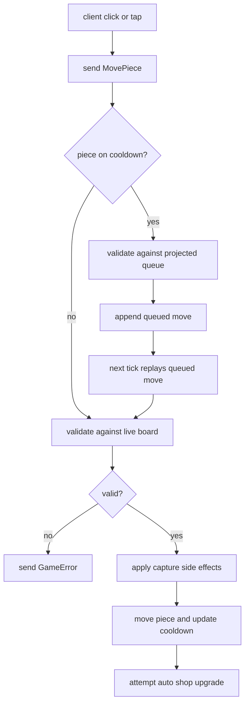

# Movement And Premoves

Movement is split across three layers:

1. shared rule validation in `common/src/logic.rs`,
2. authoritative execution in `server/src/instance/moves.rs`,
3. predictive visualization in the client reducer and game view helpers.

## Shared Validation Rules

`common::logic::is_valid_move()` answers one question: "Given the current board state, is this
specific quiet move or capture legal for this piece config?"

It enforces:

- start and end squares must differ,
- the target must be inside the current board bounds,
- quiet moves must land on an empty square,
- captures must land on an occupied non-friendly square,
- the target displacement must match one of the configured path steps,
- every earlier step in the chosen path must be empty.

The validator does not understand turns, matchmaking, shops, scoring, or victory. It only reasons
about paths, occupancy, and board bounds.

## Authoritative Server Move Flow

When a `ClientMessage::MovePiece` arrives:

1. The server confirms the piece exists and belongs to the requesting player.
2. If the piece is still on cooldown, the request may be queued instead of executed immediately.
3. Otherwise the server prepares the move against the live `GameState`.
4. If the move is valid:
   - captured pieces are removed,
   - score and kill side effects are applied,
   - hook capture events are recorded,
   - the moved piece position and cooldown are updated,
   - auto-upgrade shops may fire if the piece landed on a qualifying shop.

If any validation fails, the server returns a `GameError`.

## Cooldowns

Every piece stores:

- `last_move_time`
- `cooldown_ms`

A move is legal only when:

```text
now - last_move_time >= cooldown_ms
```

The piece config decides the next cooldown after a successful move.

## Server-Side Queued Moves

The server owns a `queued_moves: HashMap<PieceId, VecDeque<QueuedMoveRequest>>`.

Rules:

- each piece may queue up to 100 requests,
- if a piece is on cooldown, the server validates the new request against a projected future state,
- that projected future state includes earlier queued moves for the same piece,
- invalid chained premoves are rejected immediately,
- during ticks, the server replays queued moves as soon as the cooldown expires.

This avoids accepting nonsense chains such as "move to A, then instantly jump to an unreachable C".

## Client-Side Prediction

The client keeps a local `pm_queue` for immediate feedback:

- predicted piece positions are applied to a ghost map,
- the renderer shows queued path lines,
- shop actions can also be queued locally,
- the queue is reconciled against authoritative `UpdateState` messages.

The client prediction is visual only. The server still decides what actually happens.

## Auto-Upgrade Shops

Movement can trigger a shop action without a separate click.

If a piece lands on a shop where:

- `auto_upgrade_single_item == true`, and
- exactly one shop item applies to that piece,

the server purchases that item automatically after the move completes.

Bullet-mode pawn advancement uses this mechanic instead of hard-coding pawn state transitions in
move logic.

## Movement Diagram


