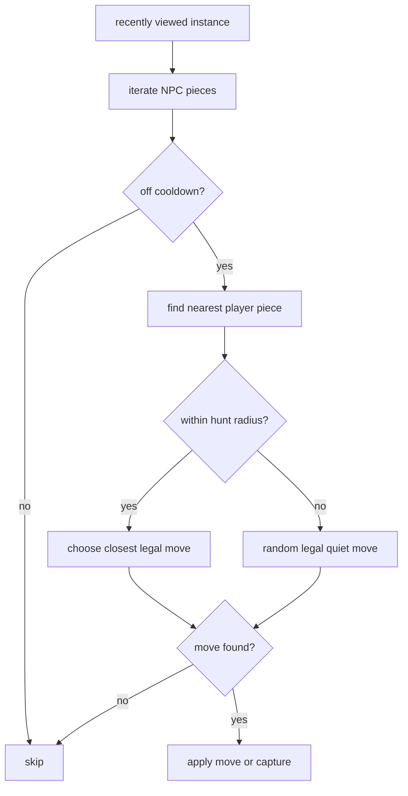

# NPCs

NPCs are ordinary pieces with `owner_id = None`.
They use the same piece configs as player-controlled pieces, but their spawning and movement logic
is entirely server-driven.

## Spawn Limits

Each mode declares `npc_limits`, where every entry contains:

- `piece_id`
- `max_expr`

`max_expr` is evaluated with one variable:

- `player_count`

For every tick in a recently viewed instance, the server:

1. counts current NPCs of that type,
2. evaluates the configured maximum,
3. spawns one new NPC if the current count is still below the cap.

## Spawn Positioning

NPC spawns reuse the general `find_spawn_pos()` helper.
The helper prefers positions that:

- are inside the board,
- are unoccupied,
- are not too close to existing pieces,
- are not too close to existing shops.

If a "good" position is not found quickly, the helper degrades to "any free valid tile", then
finally to a random in-bounds tile.

## Initial Cooldown Staggering

Fresh NPCs do not all move on the same frame.
Their initial `last_move_time` is randomized within the piece cooldown window so that different NPCs
come off cooldown at different moments.

## Movement AI

During `tick_npcs()`:

1. iterate every piece,
2. ignore owned pieces,
3. skip NPCs still on cooldown,
4. load the piece config,
5. choose a move.

### Move Choice Strategy

- Find the nearest player-owned piece.
- If that target is within roughly 12 tiles:
  - collect all legal capture moves,
  - collect all legal quiet moves,
  - choose the move that minimizes distance to the target.
- Otherwise:
  - collect legal quiet moves only,
  - choose one at random.

If no legal move exists, the NPC does nothing that tick.

## Shared Validation

NPCs do not have special movement rules.
Every candidate move is checked with the same `common::logic::is_valid_move()` function used by
player pieces.

## NPC Diagram

