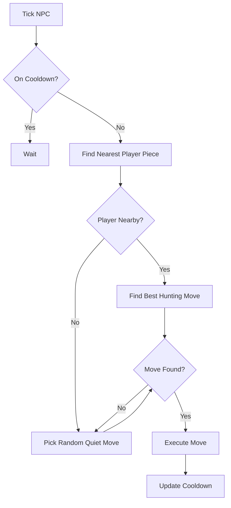

# NPC Behavior and Spawning

Non-Player Characters (NPCs) are pieces that move autonomously on the board, providing challenges and opportunities for players to gain scores.

## NPC Spawning

NPCs are spawned based on the `npc_limits` configuration for each game mode.

### Spawn Logic

1.  **Count Check**: For each NPC piece type, the server counts the number of current NPCs of that type.
2.  **Expression Evaluation**: The maximum number of allowed NPCs is calculated using the `max_expr` defined in the mode's config. This expression can depend on the current `player_count`.
3.  **Spawn Positioning**: If the current count is below the maximum, a new NPC is spawned. The server uses `find_spawn_pos` to find an empty square on the board that is not too close to existing players.
4.  **Initial Cooldown**: New NPCs receive a random initial `last_move_time` to stagger their movements.

## NPC Movement AI

NPC movement is processed every tick in `tick_npcs`.

### AI Decision Making

For each NPC piece, the AI decides its next move:

1.  **Target Selection**: The AI finds the nearest player-owned piece.
2.  **Move Prioritization**:
    *   **Hunting**: If a player piece is within a certain distance (currently 12 tiles), the AI searches for a move that minimizes the distance to that target piece. This includes searching for a capture move if possible.
    *   **Random Movement**: If no player is nearby, or no path to hunt is available, the AI picks a random legal quiet move.
3.  **Execution**: Once a target square is chosen, the move is validated and executed. If it's a capture, the player's piece is removed.

## Mermaid Diagram: NPC Decision Flow

NPCs add a dynamic element to the board, creating a more lively and challenging environment, especially in modes with lower player counts.
