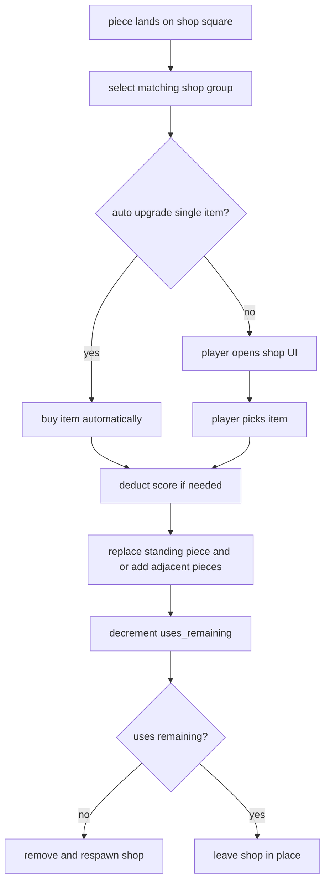

# World, Board Size, And Shops

This chapter covers the spatial rules that are broader than one move: board sizing, spawn helpers,
shop placement, and pruning.

## Board Coordinates

The board is centered around `(0, 0)` and uses `BoardCoord(IVec2)`.

For a board size `N`:

- `half = N / 2`
- `limit_pos = (N + 1) / 2`
- valid coordinates are:
  - `x >= -half && x < limit_pos`
  - `y >= -half && y < limit_pos`

That gives symmetric odd/even handling without requiring a separate origin rule.

## Board Growth And Shrink

### Growth

When a player joins:

- the server recomputes the target board size from the mode's `board_size` expression,
- if the result is larger than the current board, the instance grows immediately.

### Shrink

During ticks:

- the same expression is recomputed from current player count,
- if the result is smaller, the server checks whether any player-owned piece would be outside the target board,
- if even one player piece would be outside, the shrink is postponed,
- otherwise the board shrinks and out-of-bounds NPCs/shops are pruned.

This prevents the server from deleting active player armies during a shrink.

## Spawn Helpers

`server/src/spawning.rs` contains the common spawn utilities.

### `is_free_position()`

Checks:

- in-bounds,
- no piece on the tile,
- no shop on the tile.

### `find_adjacent_free_pos()`

Used mainly for shop purchases that add pieces.
The server checks the eight neighboring tiles in a fixed order and uses the first free one.

### `find_random_nearby_free_pos()`

Used for cluster spawns such as kit pieces placed around a chosen spawn anchor.

### `find_spawn_pos()`

Used for player spawn anchors, NPC spawns, and shop respawns.
It first searches for tiles that are not close to existing pieces or shops, then falls back to any
free tile, then finally to any in-bounds tile.

## Shop Lifecycle

Shops enter the world in two ways:

- `fixed_shops`: exact coordinates defined in the mode config,
- `shop_counts`: random placements created at instance initialization.

When a shop is used:

1. `uses_remaining` decreases.
2. If it reaches zero:
   - the shop is removed,
   - a fresh copy of the same `shop_id` respawns at a new random spawn position.

Bullet-mode invisible rule tiles use the same system, just with very large `default_uses` and transparent colors.

## Shop Interaction Summary

