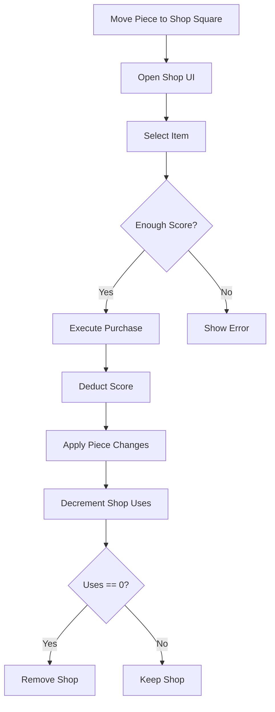

# Board and World Logic

The board environment is dynamic, resizing based on the player count and containing interactive shops that provide pieces to players.

## Board Resizing

The board's size is not fixed; it adjusts to ensure there's enough space for all active players while remaining compact enough to encourage interaction.

### Size Calculation

-   The `board_size` expression from the game mode config is evaluated using the current `player_count`.
-   The result is a square board with a dimension from `-half` to `limit_pos`.

### Resizing Sequence

1.  **Calculate Target Size**: Based on the current player count.
2.  **Safety Check**: The board only shrinks if all player-owned pieces are within the new target bounds.
3.  **Resize and Prune**: If safe, the board dimension is updated, and any NPCs or shops outside the new bounds are removed.

## Shops

Shops are structures that allow players to purchase new pieces or upgrades using their accumulated score.

### Shop Spawning

-   The number of each shop type is defined in the `shop_counts` config for the mode.
-   Shops are placed on empty squares on the board.

### Interacting with Shops

1.  **Placement**: A player must move one of their pieces onto a shop's square.
2.  **Item Selection**:
    *   The server determines which shop group to show based on the `piece_id` of the piece currently on the shop.
    *   If no specific group matches, the `default_group` is used.
3.  **Pricing**: Prices are calculated using the `price_expr` for each item, which can depend on the player's current piece counts.
4.  **Purchase**:
    *   The player must have a sufficient score.
    *   The score is deducted, and the shop's `uses` counter is decremented.
    *   If `replace_with` is set, the piece at the shop is transformed.
    *   If `add_pieces` is set, new pieces are spawned on or near the shop's square.
    *   If a shop reaches zero uses, it is removed from the board.

## Mermaid Diagram: Shop Interaction

Board resizing and shops together create a dynamic, evolving play area that rewards players for their captures and encourages them to explore and grow their army.
